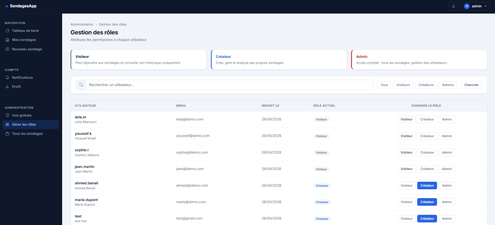

# SondagesApp — Application de sondages interactifs

Application web Django permettant de créer, diffuser et analyser des sondages et questionnaires interactifs.
**DEMO**


---

## Stack technique

| Composant | Technologie |
|-----------|-------------|
| Backend | Django 5.1 (MVT strict) |
| Base de données | MySQL 8+ / SQLite (dev) |
| Formulaires | Django Forms + django-crispy-forms |
| Auth | Django Authentication (AbstractUser) |
| UI | Bootstrap 5.3 |
| Graphiques | Chart.js 4.4 |
| Interactivité | JavaScript (vanilla) |
| Export | openpyxl (Excel), csv (standard) |
| API optionnelle | Django REST Framework (installé) |

---

## Installation

### 1. Cloner le projet

```bash
git clone https://github.com/Abdellah-elm/sondages-app
cd sondages-app
```

### 2. Créer et activer l'environnement virtuel

```bash
python -m venv venv

# Windows
venv\Scripts\activate

# Linux/Mac
source venv/bin/activate
```

### 3. Installer les dépendances

```bash
pip install -r requirements.txt
```

### 4. Configurer les variables d'environnement

Copier le fichier exemple et remplir les valeurs :

```bash
cp .env.example .env
```

Contenu du `.env` :

```env
SECRET_KEY=votre-secret-key-aleatoire
DEBUG=True
ALLOWED_HOSTS=localhost,127.0.0.1

# Base de données MySQL (production)
DB_NAME=sondages_db
DB_USER=root
DB_PASSWORD=votre_mot_de_passe
DB_HOST=localhost
DB_PORT=3306

# Email (optionnel)
EMAIL_HOST=smtp.gmail.com
EMAIL_PORT=587
EMAIL_HOST_USER=votre@email.com
EMAIL_HOST_PASSWORD=votre_app_password
DEFAULT_FROM_EMAIL=noreply@sondages.local
```

> **Note :** En développement, le projet utilise SQLite automatiquement (aucun MySQL requis).

### 5. Créer la base de données MySQL (production uniquement)

```sql
CREATE DATABASE sondages_db CHARACTER SET utf8mb4 COLLATE utf8mb4_unicode_ci;
```

### 6. Appliquer les migrations

```bash
python manage.py migrate
```

### 7. Créer le super-administrateur

```bash
python manage.py createsuperuser
```

> Le superutilisateur reçoit automatiquement le rôle `admin`.

### 8. Lancer le serveur de développement

```bash
python manage.py runserver
```

Accéder à : **http://127.0.0.1:8000**

---

## Structure du projet

```
sondages-app/
├── apps/
│   ├── accounts/        # Gestion utilisateurs (Utilisateur, Profil, rôles)
│   ├── surveys/         # Sondages, sections, questions, choix
│   ├── responses/       # Soumissions et réponses des participants
│   ├── analytics/       # Statistiques et visualisations
│   └── dashboard/       # Tableau de bord et notifications
├── config/
│   ├── settings/
│   │   ├── base.py      # Paramètres communs
│   │   ├── development.py  # SQLite, emails console
│   │   └── production.py   # MySQL, sécurité renforcée
│   └── urls.py          # Routage principal
├── templates/           # Templates HTML (base.html + par app)
├── static/              # Fichiers statiques (CSS, JS)
├── media/               # Uploads (avatars)
├── requirements.txt
└── manage.py
```

---

## Fonctionnalités

### Système de rôles

| Rôle | Description | Capacités |
|------|-------------|-----------|
| **Visiteur** | Compte par défaut à l'inscription | Répondre aux sondages, voir son historique |
| **Créateur** | Promu par un admin | Créer/gérer/analyser ses propres sondages |
| **Admin** | Superutilisateur ou promu | Tout + gestion globale des utilisateurs et sondages |

> Pour promouvoir un utilisateur : se connecter en admin → `/dashboard/admin/utilisateurs/`

### Types de questions

- **Choix unique** — boutons radio
- **Choix multiple** — cases à cocher
- **Échelle** — slider numérique (min/max configurables)
- **Texte libre** — zone de texte

### Logique conditionnelle

Une question peut être liée à un choix d'une question précédente : elle n'apparaît que si ce choix est sélectionné. Configurable dans le builder (modal "Logique conditionnelle").

### Personnalisation de l'apparence

4 thèmes disponibles pour chaque sondage :

| Thème | Couleurs |
|-------|----------|
| Défaut | Bleu |
| Moderne | Violet |
| Professionnel | Vert |
| Chaleureux | Orange |

### Protection et restrictions

- **Mot de passe** : optionnel par sondage
- **Date limite** : fermeture automatique à une date/heure
- **Durée maximale** : minuteur décompte affiché au participant
- **Nombre max de réponses** : fermeture automatique quand atteint
- **Anti-doublon** : basé sur la session, une seule réponse par navigateur

---

## URLs principales

| URL | Description | Accès |
|-----|-------------|-------|
| `/` | Accueil → redirection | Tous |
| `/accounts/inscription/` | Inscription | Anonyme |
| `/accounts/connexion/` | Connexion | Anonyme |
| `/dashboard/` | Tableau de bord personnel | Connecté |
| `/surveys/` | Liste de mes sondages | Créateur+ |
| `/surveys/create/` | Créer un sondage | Créateur+ |
| `/surveys/<slug>/builder/` | Éditeur de questions | Créateur+ |
| `/surveys/<slug>/share/` | Liens de partage | Créateur+ |
| `/analytics/<slug>/` | Résultats et graphiques | Créateur+ |
| `/r/<uuid>/` | Formulaire public (participation) | Tous |
| `/dashboard/admin/` | Panneau admin | Admin |
| `/dashboard/admin/utilisateurs/` | Gestion des rôles | Admin |
| `/admin/` | Django admin | Superuser |

---

## Déploiement en production

### Variables d'environnement

```env
DEBUG=False
SECRET_KEY=<clé-longue-et-aléatoire>
ALLOWED_HOSTS=votre-domaine.com
DB_NAME=sondages_db
DB_USER=<db_user>
DB_PASSWORD=<db_password>
DB_HOST=<db_host>
```

### Commandes de déploiement

```bash
# Utiliser les settings de production
export DJANGO_SETTINGS_MODULE=config.settings.production

# Collecter les fichiers statiques
python manage.py collectstatic --noinput

# Appliquer les migrations
python manage.py migrate

# Gunicorn (exemple)
gunicorn config.wsgi:application --bind 0.0.0.0:8000
```

---

## Tests

```bash
# Installer les dépendances de dev
pip install -r requirements-dev.txt

# Lancer les tests
pytest

# Avec couverture
pytest --cov=apps --cov-report=html
```

---

## Auteur

Projet académique — Application de sondages interactifs  
**Abdellah EL MLIH**
